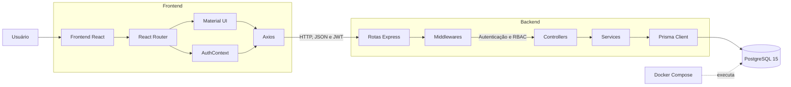
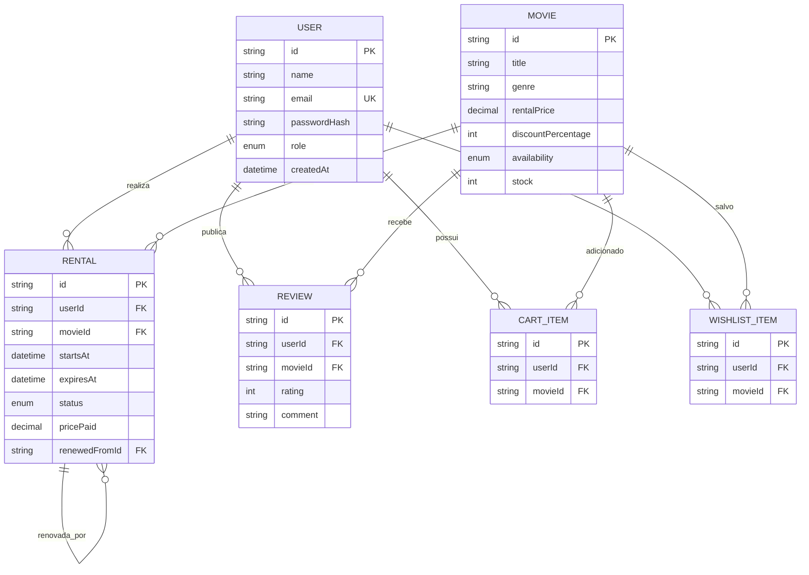
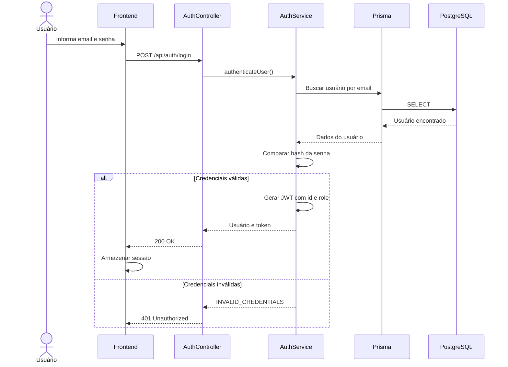
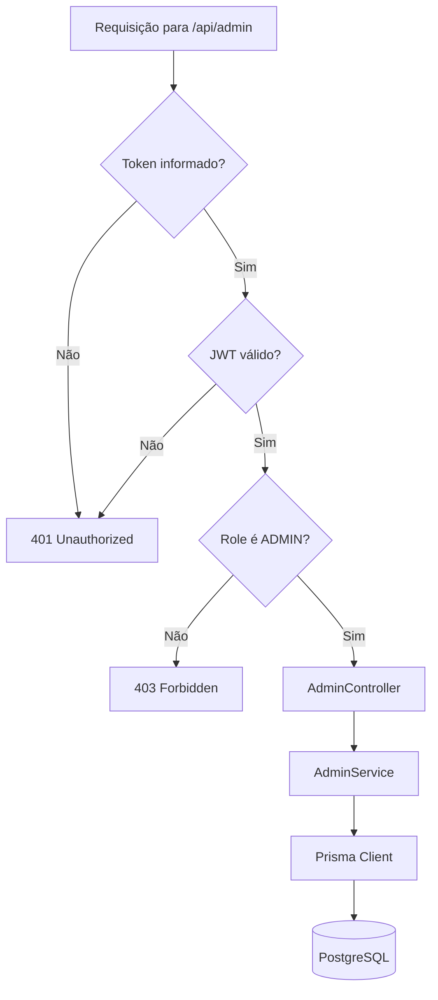
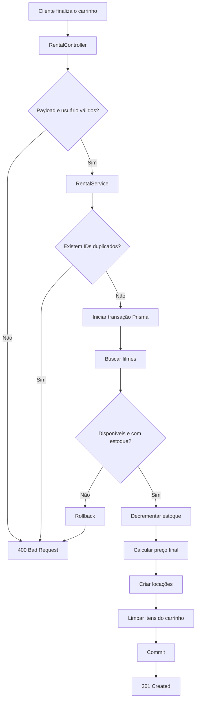
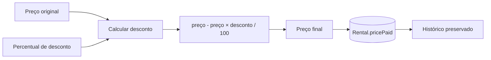
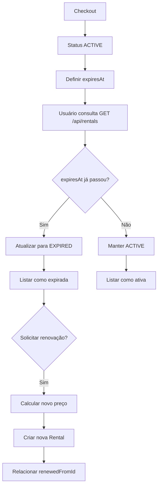
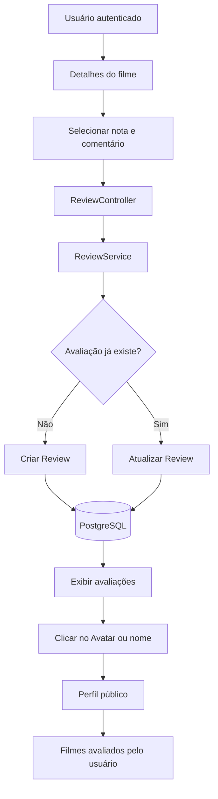
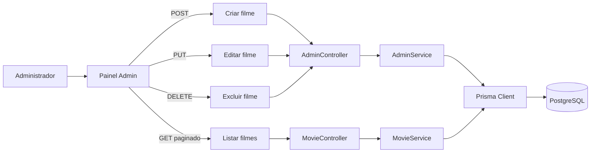
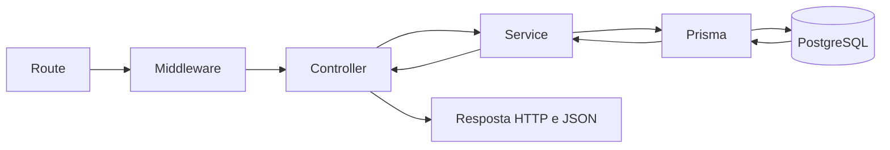

# Cinerent — Diagramas para apresentação

## 1. Arquitetura geral

## 2. Modelo de dados com Prisma

## 3. Autenticação com JWT

## 4. Autorização e RBAC administrativo

## 5. Checkout transacional

## 6. Cálculo e persistência do desconto

## 7. Expiração e renovação

## 8. Avaliações e perfil social

## 9. CRUD administrativo de filmes

## 10. Fluxo resumido de uma requisição

